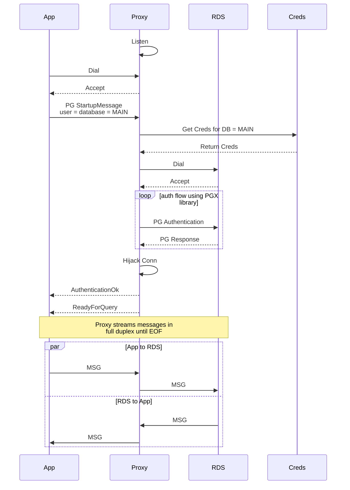

PG Proxy
========

```mermaid
sequenceDiagram
    participant App
    participant Proxy
    participant RDS


    Proxy ->> Proxy : Listen
    App ->> Proxy : Dial
    Proxy -->> App : Accept
    App ->> Proxy : PG StartupMessage<br>user = database = MAIN
    Proxy ->> Creds : Get Creds for DB = MAIN
    Creds -->> Proxy : Return Creds
    Proxy ->> RDS : Dial
    RDS -->> Proxy : Accept
    loop auth flow using PGX library
        Proxy ->> RDS : PG Authentication
        RDS -->> Proxy : PG Response
    end
    Proxy ->> Proxy : Hijack Conn
    Proxy -->> App : AuthenticationOk
    Proxy -->> App : ReadyForQuery

    note over App,RDS: Proxy streams messages in <br> full duplex until EOF

    par App to RDS
        App ->> Proxy : MSG
        Proxy ->> RDS : MSG
    and RDS to App
        RDS ->> Proxy : MSG
        Proxy ->> App : MSG
    end


```

